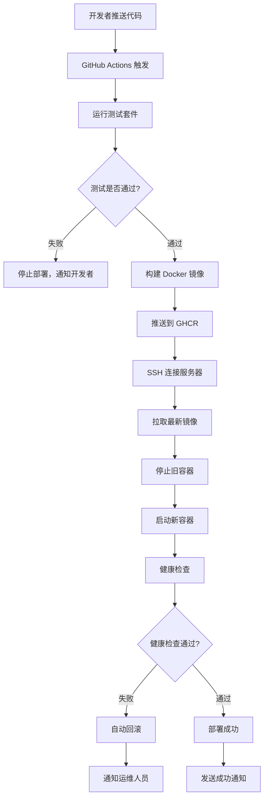

# AMTools Backend GitHub Actions + Docker 部署方案总结

> 🎉 **完整的 GitHub Actions 自动部署方案已创建完成！**

## 📁 创建的文件清单

### 🐳 Docker 相关文件
- **`Dockerfile`** - 多阶段构建的 Docker 镜像配置
- **`docker-compose.yml`** - 完整的服务编排配置
- **`.dockerignore`** - Docker 构建忽略文件

### 🚀 GitHub Actions 工作流
- **`.github/workflows/deploy.yml`** - 自动化 CI/CD 流水线
  - 自动测试
  - 构建 Docker 镜像
  - 推送到 GitHub Container Registry
  - 自动部署到远程服务器

### 📜 部署脚本
- **`scripts/deploy.sh`** - 服务器部署脚本
- **`nginx/nginx.conf`** - Nginx 反向代理配置
- **`.env.docker`** - Docker 环境配置模板

### 📚 文档套件
- **`docs/quick-start-guide.md`** - 新手5分钟快速部署指南 ⭐
- **`docs/deployment-guide.md`** - 完整的生产环境部署文档
- **`docs/deployment-checklist.md`** - 部署成功验证清单
- **`docs/README.md`** - 更新的文档中心导航

### 🔧 配置文件
- **`.gitignore`** (根目录) - 项目级别忽略规则
- **`amtools-backend/.gitignore`** - 后端项目忽略规则
- **`docs/.gitignore`** - 文档目录忽略规则
- **`.gitattributes`** - Git 文件属性配置
- **`GIT-SETUP.md`** - Git 配置说明文档

## 🎯 部署方案特点

### ✅ **完全自动化**
- 推送代码 → 自动测试 → 自动构建 → 自动部署
- 零停机部署，自动健康检查
- 失败自动回滚机制

### 🛡️ **生产级安全**
- 多阶段 Docker 构建，优化镜像大小
- 非 root 用户运行容器
- SSL/TLS 支持，安全配置
- 环境变量隔离，敏感信息保护

### 📊 **监控和维护**
- 容器健康检查
- 日志轮转和管理
- 自动备份策略
- 性能监控和告警

### 🔧 **灵活部署**
- 支持多种部署方式
- 环境配置模板化
- 回滚和版本管理
- 扩展性强

## 🚀 使用方法

### 新手用户 (推荐)
1. 阅读 **[新手快速入门指南](./docs/quick-start-guide.md)**
2. 按照 5 个步骤完成部署
3. 使用 **[部署检查清单](./docs/deployment-checklist.md)** 验证

### 高级用户
1. 查看 **[完整部署指南](./docs/deployment-guide.md)**
2. 自定义配置和优化
3. 设置监控和维护策略

## 📋 部署流程图

## 🔧 技术栈

### 核心技术
- **Node.js 18+** - 运行时环境
- **TypeScript** - 开发语言
- **Docker** - 容器化
- **GitHub Actions** - CI/CD

### 基础设施
- **GitHub Container Registry** - 镜像仓库
- **Nginx** - 反向代理
- **PostgreSQL/SQLite** - 数据库
- **Redis** - 缓存 (可选)

### 部署工具
- **Docker Compose** - 服务编排
- **SSH** - 远程部署
- **Shell Scripts** - 自动化脚本

## 📊 性能优化

### Docker 镜像优化
- 多阶段构建，减少镜像大小
- Alpine Linux 基础镜像
- 层缓存优化
- 安全扫描

### 部署优化
- 零停机部署
- 健康检查机制
- 自动回滚策略
- 资源限制配置

### 监控优化
- 容器资源监控
- 应用性能监控
- 日志聚合分析
- 告警机制

## 🛡️ 安全措施

### 容器安全
- 非 root 用户运行
- 最小权限原则
- 安全基础镜像
- 定期安全更新

### 网络安全
- HTTPS 强制跳转
- CORS 配置
- 防火墙规则
- SSH 密钥认证

### 数据安全
- 环境变量加密
- 数据库连接加密
- 备份加密存储
- 访问日志记录

## 📈 扩展性

### 水平扩展
- 负载均衡配置
- 多实例部署
- 数据库读写分离
- 缓存集群

### 垂直扩展
- 资源限制调整
- 性能参数优化
- 监控指标调优
- 容量规划

## 🔍 故障排除

### 常见问题
- GitHub Actions 失败
- 容器启动失败
- 数据库连接问题
- 网络访问问题

### 诊断工具
- 日志分析脚本
- 健康检查命令
- 性能监控工具
- 网络诊断工具

### 恢复策略
- 自动回滚机制
- 备份恢复流程
- 紧急修复流程
- 灾难恢复计划

## 🎉 总结

这套部署方案提供了：

✅ **完整的自动化部署流程**
✅ **生产级的安全配置**
✅ **详细的新手指南**
✅ **完善的监控和维护**
✅ **灵活的扩展能力**

无论您是新手还是经验丰富的开发者，都可以通过这套方案快速、安全地部署 AMTools Backend 到生产环境。

**🚀 现在就开始您的部署之旅吧！**

---

**文档版本**: v1.0.0  
**创建日期**: 2025-06-29  
**维护团队**: AMTools 开发团队
