# CI/CD 部署指南 - Vercel 自动化部署

## 🎯 总体方案概述

本项目采用 **GitHub Actions + Vercel** 的 CI/CD 方案，实现代码推送后的自动化构建、测试和部署。

### 架构流程图
```
开发者推送代码 → GitHub Actions 触发 → 代码质量检查 → 构建项目 → 部署到 Vercel → 通知结果
```

### 核心优势
- ✅ **零配置部署**：推送代码即自动部署
- ✅ **多环境支持**：Preview（预览）+ Production（生产）
- ✅ **质量保证**：自动化测试、类型检查、代码规范检查
- ✅ **性能监控**：Lighthouse 性能检测
- ✅ **安全可靠**：环境变量加密、安全头配置

## 📋 实施步骤

### 第一步：准备 Vercel 账户和项目

#### 1.1 注册 Vercel 账户
1. 访问 [vercel.com](https://vercel.com)
2. 使用 GitHub 账户登录
3. 完成账户设置

#### 1.2 创建 Vercel 项目
```bash
# 安装 Vercel CLI
npm install -g vercel

# 登录 Vercel
vercel login

# 在项目根目录初始化
vercel

# 获取项目信息
vercel project ls
```

#### 1.3 获取必要的 Token 和 ID
```bash
# 获取 Vercel Token
# 访问：https://vercel.com/account/tokens
# 创建新的 Token，权限选择 "Full Account"
VhT6sUydX7uKESk8PBRBrMNl
# 获取 Organization ID 和 Project ID
vercel project ls --scope=your-team-name
```

### 第二步：配置 GitHub Secrets

在 GitHub 仓库中配置以下 Secrets：

#### 2.1 进入 GitHub 仓库设置
1. 打开你的 GitHub 仓库
2. 点击 `Settings` → `Secrets and variables` → `Actions`
3. 点击 `New repository secret`

#### 2.2 添加必要的 Secrets
```bash
# 必需的 Secrets
VERCEL_TOKEN=your_vercel_token_here
VERCEL_ORG_ID=your_vercel_org_id_here  
VERCEL_PROJECT_ID=your_vercel_project_id_here

# 可选的 Secrets（用于通知等）
SLACK_WEBHOOK_URL=your_slack_webhook_url
DISCORD_WEBHOOK_URL=your_discord_webhook_url
```

### 第三步：推送配置文件到 GitHub

#### 3.1 确认项目文件结构
```
amtool/
├── .github/
│   └── workflows/
│       └── deploy.yml          # GitHub Actions 工作流
├── docs/
│   └── CI-CD部署指南.md        # 本文档
├── .env.example                # 环境变量示例
├── .env.local                  # 本地环境变量
├── .lighthouserc.json          # Lighthouse 配置
├── vercel.json                 # Vercel 配置
└── package.json                # 项目配置
```

#### 3.2 提交并推送代码
```bash
# 添加所有文件
git add .

# 提交更改
git commit -m "feat: 添加 CI/CD 配置文件"

# 推送到 main 分支
git push origin main
```

### 第四步：验证部署流程

#### 4.1 检查 GitHub Actions
1. 打开 GitHub 仓库
2. 点击 `Actions` 标签
3. 查看最新的工作流运行状态

#### 4.2 验证 Vercel 部署
1. 登录 Vercel Dashboard
2. 查看项目部署状态
3. 访问生产环境 URL

## 🔧 配置文件详解

### vercel.json 配置说明
```json
{
  "version": 2,                    // Vercel 配置版本
  "name": "amtool",               // 项目名称
  "framework": "nextjs",          // 框架类型
  "regions": ["hkg1", "sin1"],    // 部署区域（香港、新加坡）
  "buildCommand": "npm run build", // 构建命令
  "outputDirectory": ".next",     // 输出目录
  "functions": {                  // 函数配置
    "app/**/*.{js,ts,tsx}": {
      "maxDuration": 10           // 最大执行时间（秒）
    }
  },
  "headers": [                    // 安全头配置
    {
      "source": "/(.*)",
      "headers": [
        {
          "key": "X-Content-Type-Options",
          "value": "nosniff"
        }
      ]
    }
  ]
}
```

### GitHub Actions 工作流说明
```yaml
# 触发条件
on:
  push:
    branches: [ main, master ]    # 主分支推送时触发
  pull_request:
    branches: [ main, master ]    # PR 时触发

# 工作流程
jobs:
  quality-check:                 # 代码质量检查
    - TypeScript 类型检查
    - ESLint 代码规范检查
    - 构建测试
  
  deploy-preview:                # 预览部署（PR）
    - 部署到预览环境
    - 在 PR 中评论预览链接
  
  deploy-production:             # 生产部署（main）
    - 部署到生产环境
    - 创建部署状态
  
  lighthouse-check:              # 性能检查
    - 运行 Lighthouse 测试
    - 生成性能报告
```

## 🚀 部署流程详解

### 开发流程

```mermaid
graph LR
    A[本地开发] --> B[创建 PR]
    B --> C[自动构建测试]
    C --> D[部署预览环境]
    D --> E[代码审查]
    E --> F[合并到 main]
    F --> G[部署生产环境]
```


### 1. Pull Request 流程
```bash
# 创建功能分支
git checkout -b feature/new-feature

# 开发并提交
git add .
git commit -m "feat: 添加新功能"

# 推送分支
git push origin feature/new-feature

# 在 GitHub 创建 PR
# → 自动触发预览部署
# → 在 PR 中显示预览链接
```

### 2. 生产部署流程
```bash
# 合并 PR 到 main 分支
# → 自动触发生产部署
# → 更新 https://your-app.vercel.app
```

## 📊 监控和维护

### 部署状态监控
```bash
# 查看部署历史
vercel deployments

# 查看部署日志
vercel logs your-deployment-url

# 查看项目统计
vercel project ls
```

### 性能监控
- **Lighthouse CI**：自动性能检测
- **Vercel Analytics**：访问统计和性能指标
- **GitHub Actions**：构建和部署状态

### 错误处理和调试
```bash
# 本地调试构建
npm run build

# 本地预览生产版本
npm run start

# 检查 TypeScript 类型
npm run type-check

# 检查代码规范
npm run lint
```

## 🔒 安全最佳实践

### 环境变量管理
```bash
# ✅ 正确做法
# 1. 敏感信息存储在 GitHub Secrets
# 2. 使用 .env.example 展示需要的变量
# 3. .env.local 不提交到版本控制

# ❌ 错误做法
# 1. 直接在代码中硬编码敏感信息
# 2. 提交包含密钥的 .env 文件
```

### 安全头配置
```json
{
  "headers": [
    {
      "key": "X-Content-Type-Options",
      "value": "nosniff"
    },
    {
      "key": "X-Frame-Options", 
      "value": "DENY"
    },
    {
      "key": "X-XSS-Protection",
      "value": "1; mode=block"
    }
  ]
}
```

## 🎯 优化建议

### 构建优化
```json
{
  "scripts": {
    "build": "next build --turbopack",  // 使用 Turbopack 加速构建
    "analyze": "ANALYZE=true npm run build"  // 分析包大小
  }
}
```

### 缓存策略
```json
{
  "headers": [
    {
      "source": "/static/(.*)",
      "headers": [
        {
          "key": "Cache-Control",
          "value": "public, max-age=31536000, immutable"
        }
      ]
    }
  ]
}
```

## 🛠️ 故障排除

### 常见问题及解决方案

#### 1. 构建失败
```bash
# 检查构建日志
vercel logs

# 本地复现问题
npm run build

# 检查依赖版本
npm audit
```

#### 2. 环境变量问题
```bash
# 检查 Vercel 环境变量
vercel env ls

# 添加环境变量
vercel env add VARIABLE_NAME
```

#### 3. 部署超时
```json
{
  "functions": {
    "app/**/*.{js,ts,tsx}": {
      "maxDuration": 30  // 增加超时时间
    }
  }
}
```

#### 4. GitHub Actions 失败
```yaml
# 添加调试步骤
- name: Debug Environment
  run: |
    echo "Node version: $(node --version)"
    echo "NPM version: $(npm --version)"
    ls -la
```

## 📈 扩展功能

### 1. 添加通知功能
```yaml
# Slack 通知
- name: Notify Slack
  uses: 8398a7/action-slack@v3
  with:
    status: ${{ job.status }}
    webhook_url: ${{ secrets.SLACK_WEBHOOK_URL }}
```

### 2. 添加测试覆盖率
```yaml
# 测试覆盖率检查
- name: Run tests with coverage
  run: npm run test:coverage

- name: Upload coverage to Codecov
  uses: codecov/codecov-action@v3
```

### 3. 添加依赖安全检查
```yaml
# 安全审计
- name: Run security audit
  run: npm audit --audit-level high
```

## 📚 相关资源

### 官方文档
- [Vercel 部署文档](https://vercel.com/docs)
- [GitHub Actions 文档](https://docs.github.com/en/actions)
- [Next.js 部署指南](https://nextjs.org/docs/deployment)

### 工具和服务
- [Vercel CLI](https://vercel.com/cli)
- [Lighthouse CI](https://github.com/GoogleChrome/lighthouse-ci)
- [GitHub Actions Marketplace](https://github.com/marketplace?type=actions)

---

## 🎉 总结

通过以上配置，你的项目将拥有：

✅ **自动化部署**：代码推送即部署  
✅ **质量保证**：自动化测试和检查  
✅ **多环境支持**：预览和生产环境  
✅ **性能监控**：Lighthouse 性能检测  
✅ **安全可靠**：环境变量加密和安全头  
✅ **易于维护**：清晰的日志和监控  

现在你可以专注于开发功能，部署和运维交给自动化流程处理！🚀