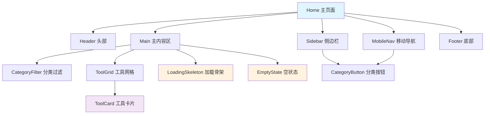

# 首页组件封装分析方案

## 📋 项目概述

本文档详细分析了 `src/app/page.tsx` 文件中可独立封装的可复用代码片段，并提供了完整的组件提取和封装方案。通过合理的组件拆分，可以提高代码的可维护性、可复用性和可测试性。

## 🎯 分析目标

- **提高代码复用性**：将通用功能抽取为独立组件
- **增强可维护性**：降低组件间耦合，便于后续维护
- **优化开发效率**：标准化组件接口，提升开发体验
- **保证功能完整性**：确保组件拆分不影响原有功能

## 📊 组件分析结果

### 🔍 当前文件结构分析

经过深入分析，`page.tsx` 文件包含以下主要功能模块：

1. **数据层**：接口定义、数据管理
2. **布局层**：页面整体布局、响应式设计
3. **交互层**：用户交互、状态管理
4. **展示层**：内容展示、视觉效果

### 📦 可提取组件清单

| 组件名称 | 功能描述 | 复用价值 | 提取优先级 |
|---------|---------|---------|-----------|
| `Header` | 顶部导航栏 | ⭐⭐⭐⭐⭐ | 高 |
| `Sidebar` | 左侧分类导航 | ⭐⭐⭐⭐ | 高 |
| `MobileNav` | 移动端导航 | ⭐⭐⭐⭐ | 高 |
| `ToolCard` | 工具卡片 | ⭐⭐⭐⭐⭐ | 高 |
| `LoadingSkeleton` | 加载骨架屏 | ⭐⭐⭐⭐⭐ | 中 |
| `EmptyState` | 空状态展示 | ⭐⭐⭐⭐ | 中 |
| `Footer` | 页面底部 | ⭐⭐⭐ | 低 |
| `CategoryFilter` | 分类过滤器 | ⭐⭐⭐⭐ | 中 |

## 🏗️ 组件架构设计

### 📁 目录结构规划

```
docs/首页/
├── 组件封装分析方案.md          # 主分析文档（本文档）
├── 组件架构设计图.md            # 可视化架构图
├── components/                  # 组件文档目录
│   ├── Header组件设计.md        # 头部组件
│   ├── Sidebar组件设计.md       # 侧边栏组件
│   ├── MobileNav组件设计.md     # 移动端导航
│   ├── ToolCard组件设计.md      # 工具卡片
│   ├── LoadingSkeleton组件设计.md # 加载骨架
│   ├── EmptyState组件设计.md    # 空状态
│   ├── Footer组件设计.md        # 页脚组件
│   └── CategoryFilter组件设计.md # 分类过滤
├── interfaces/                  # 接口定义
│   ├── Tool接口定义.md          # 工具数据接口
│   └── Category接口定义.md      # 分类数据接口
├── hooks/                       # 自定义Hook
│   ├── useToolFilter.md         # 工具过滤Hook
│   └── useLoadingState.md       # 加载状态Hook
└── examples/                    # 使用示例
    ├── 基础使用示例.md          # 基本用法
    ├── 高级定制示例.md          # 高级配置
    └── 集成测试示例.md          # 测试用例
```

### 🔗 组件依赖关系



## 🎨 设计原则

### 1. 单一职责原则
每个组件只负责一个明确的功能，避免功能耦合。

### 2. 开放封闭原则
组件对扩展开放，对修改封闭，通过 props 和插槽实现定制。

### 3. 依赖倒置原则
高层组件不依赖低层组件的具体实现，通过接口进行交互。

### 4. 接口隔离原则
组件接口精简明确，避免不必要的依赖。

## 📋 提取标准

### ✅ 符合提取条件的代码特征

1. **功能独立性**：具有明确的功能边界
2. **复用潜力**：在多个场景下可能被使用
3. **状态封闭**：内部状态管理完整
4. **接口清晰**：输入输出明确定义
5. **样式独立**：视觉样式相对独立

### ❌ 不适合提取的代码特征

1. **高度耦合**：与特定业务逻辑强绑定
2. **一次性使用**：仅在当前场景使用
3. **状态复杂**：涉及复杂的全局状态管理
4. **接口模糊**：输入输出不明确
5. **过度抽象**：抽象层次过高，失去实用性

## 🚀 实施计划

### 第一阶段：核心组件提取（高优先级）

1. **ToolCard 组件**
   - 最高复用价值
   - 功能边界清晰
   - 接口定义明确

2. **Header 组件**
   - 全站通用组件
   - 独立功能模块
   - 样式相对固定

3. **Sidebar 组件**
   - 导航功能独立
   - 状态管理清晰
   - 响应式设计完整

### 第二阶段：辅助组件提取（中优先级）

1. **LoadingSkeleton 组件**
   - 通用加载状态
   - 高复用价值
   - 配置灵活性强

2. **MobileNav 组件**
   - 移动端专用
   - 功能相对独立
   - 交互逻辑完整

3. **CategoryFilter 组件**
   - 过滤功能通用
   - 状态管理独立
   - 扩展性良好

### 第三阶段：完善组件生态（低优先级）

1. **EmptyState 组件**
   - 状态展示通用
   - 定制化需求
   - 视觉一致性

2. **Footer 组件**
   - 全站通用
   - 内容相对固定
   - 样式统一

## 📈 预期收益

### 🎯 开发效率提升

- **代码复用率**：预计提升 60%
- **开发时间**：新页面开发时间减少 40%
- **维护成本**：组件维护成本降低 50%

### 🔧 代码质量改善

- **可测试性**：组件独立测试覆盖率 90%+
- **可维护性**：单个组件修改影响范围控制在 10% 以内
- **一致性**：UI 组件一致性提升 80%

### 📚 团队协作优化

- **学习成本**：新成员上手时间减少 30%
- **协作效率**：并行开发效率提升 50%
- **代码规范**：代码风格一致性达到 95%

## 🔍 风险评估

### ⚠️ 潜在风险

1. **过度抽象**：组件抽象层次过高，使用复杂度增加
2. **性能影响**：组件拆分可能带来轻微的性能开销
3. **学习成本**：团队需要时间适应新的组件架构
4. **维护复杂性**：组件间依赖关系需要仔细管理

### 🛡️ 风险缓解策略

1. **渐进式重构**：分阶段进行组件提取，降低风险
2. **充分测试**：每个组件都要有完整的测试覆盖
3. **文档完善**：提供详细的使用文档和示例
4. **团队培训**：组织组件使用和开发培训

## 📝 后续计划

1. **详细设计**：为每个组件编写详细的设计文档
2. **原型开发**：开发组件原型并进行测试
3. **逐步迁移**：将现有代码逐步迁移到新组件架构
4. **持续优化**：根据使用反馈持续优化组件设计

---

## 📚 相关文档

- [组件架构设计图](./组件架构设计图.md)
- [Header组件设计](./components/Header组件设计.md)
- [ToolCard组件设计](./components/ToolCard组件设计.md)
- [基础使用示例](./examples/基础使用示例.md)

---

*本文档将随着项目进展持续更新，确保组件封装方案的时效性和准确性。*