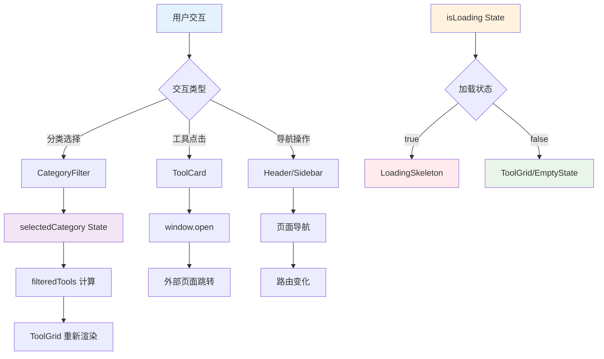
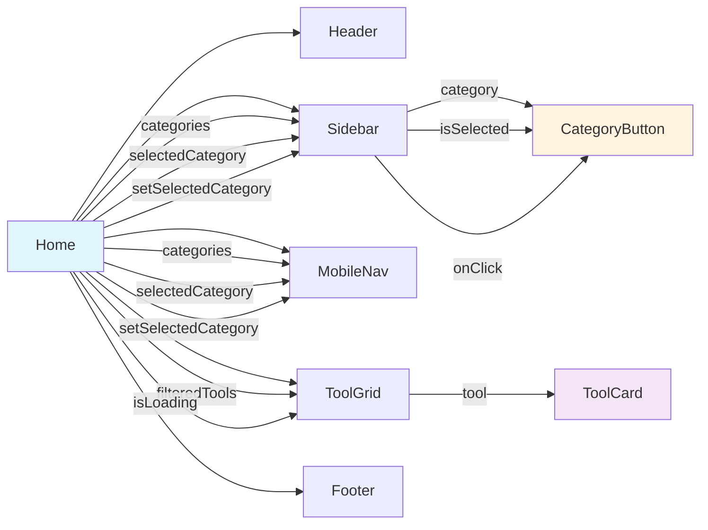
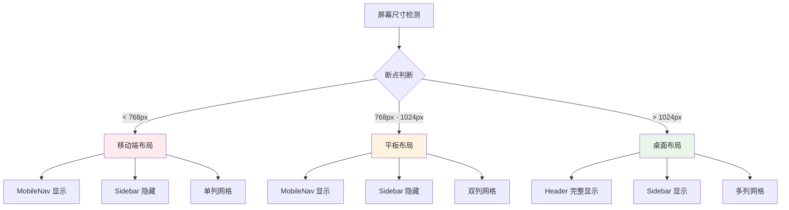

# 组件架构设计图

## 🎯 架构概览

本文档通过可视化图表展示首页组件的架构设计、依赖关系和数据流向，帮助开发者快速理解组件间的交互模式。

## 🏗️ 整体架构图

### 📊 组件层次结构

```
┌─────────────────────────────────────────────────────────────┐
│                        Home 主页面                           │
│  ┌─────────────────────────────────────────────────────────┐ │
│  │                    Header 头部组件                       │ │
│  │  ┌─────────────┐  ┌─────────────┐  ┌─────────────────┐  │ │
│  │  │   Logo      │  │  Navigation │  │   UserActions   │  │ │
│  │  │   品牌标识   │  │    导航菜单  │  │    用户操作区    │  │ │
│  │  └─────────────┘  └─────────────┘  └─────────────────┘  │ │
│  └─────────────────────────────────────────────────────────┘ │
│                                                               │
│  ┌─────────────────────────────────────────────────────────┐ │
│  │                     Main 主内容区                        │ │
│  │  ┌─────────────┐  ┌─────────────────────────────────────┐│ │
│  │  │   Sidebar   │  │           Content Area              ││ │
│  │  │   侧边栏     │  │            内容区域                 ││ │
│  │  │             │  │  ┌─────────────────────────────────┐││ │
│  │  │ ┌─────────┐ │  │  │      CategoryFilter             │││ │
│  │  │ │Category │ │  │  │       分类过滤器                │││ │
│  │  │ │Button   │ │  │  └─────────────────────────────────┘││ │
│  │  │ │分类按钮  │ │  │                                     ││ │
│  │  │ └─────────┘ │  │  ┌─────────────────────────────────┐││ │
│  │  └─────────────┘  │  │         ToolGrid                │││ │
│  │                   │  │         工具网格                │││ │
│  │  ┌─────────────┐  │  │  ┌─────────┐ ┌─────────┐       │││ │
│  │  │  MobileNav  │  │  │  │ToolCard │ │ToolCard │  ...  │││ │
│  │  │  移动端导航  │  │  │  │工具卡片 │ │工具卡片 │       │││ │
│  │  └─────────────┘  │  │  └─────────┘ └─────────┘       │││ │
│  │                   │  └─────────────────────────────────┘││ │
│  │                   │                                     ││ │
│  │                   │  ┌─────────────────────────────────┐││ │
│  │                   │  │    LoadingSkeleton/EmptyState   │││ │
│  │                   │  │      加载状态/空状态组件         │││ │
│  │                   │  └─────────────────────────────────┘││ │
│  │                   └─────────────────────────────────────┘│ │
│  └─────────────────────────────────────────────────────────┘ │
│                                                               │
│  ┌─────────────────────────────────────────────────────────┐ │
│  │                    Footer 底部组件                       │ │
│  │  ┌─────────────┐  ┌─────────────┐  ┌─────────────────┐  │ │
│  │  │  Copyright  │  │    Links    │  │   SocialMedia   │  │ │
│  │  │   版权信息   │  │    链接区    │  │    社交媒体     │  │ │
│  │  └─────────────┘  └─────────────┘  └─────────────────┘  │ │
│  └─────────────────────────────────────────────────────────┘ │
└─────────────────────────────────────────────────────────────┘
```

## 🔄 数据流向图

### 📈 状态管理流程



### 🎛️ Props 传递关系



## 🧩 组件接口设计

### 📋 核心组件接口

#### 1. Header 组件

```typescript
interface HeaderProps {
  // 基础配置
  title?: string;
  subtitle?: string;
  logo?: React.ReactNode;
  
  // 导航配置
  navigation?: NavigationItem[];
  showNavigation?: boolean;
  
  // 用户操作
  actions?: ActionButton[];
  onSubmitTool?: () => void;
  
  // 样式配置
  className?: string;
  variant?: 'default' | 'compact' | 'minimal';
}

interface NavigationItem {
  id: string;
  label: string;
  href: string;
  active?: boolean;
}

interface ActionButton {
  id: string;
  label: string;
  icon?: React.ReactNode;
  onClick: () => void;
  variant?: 'primary' | 'secondary';
}
```

#### 2. ToolCard 组件

```typescript
interface ToolCardProps {
  // 工具数据
  tool: Tool;
  
  // 交互配置
  onClick?: (tool: Tool) => void;
  onFavorite?: (toolId: string) => void;
  
  // 显示配置
  showVisits?: boolean;
  showTags?: boolean;
  showDescription?: boolean;
  
  // 样式配置
  className?: string;
  variant?: 'default' | 'compact' | 'detailed';
  size?: 'small' | 'medium' | 'large';
}

interface Tool {
  id: string;
  name: string;
  description: string;
  url: string;
  icon: string;
  category: string;
  visits: string;
  hot?: boolean;
  new?: boolean;
  tags?: string[];
  highlights?: string[];
}
```

#### 3. Sidebar 组件

```typescript
interface SidebarProps {
  // 分类数据
  categories: CategoryWithCount[];
  selectedCategory: string;
  onCategoryChange: (category: string) => void;
  
  // 显示配置
  title?: string;
  showCounts?: boolean;
  collapsible?: boolean;
  
  // 样式配置
  className?: string;
  width?: number;
  position?: 'left' | 'right';
}

interface CategoryWithCount {
  id: string;
  name: string;
  count: number;
  icon?: string;
}
```

#### 4. LoadingSkeleton 组件

```typescript
interface LoadingSkeletonProps {
  // 骨架配置
  count?: number;
  variant?: 'card' | 'list' | 'grid';
  
  // 动画配置
  animation?: 'pulse' | 'wave' | 'none';
  speed?: 'slow' | 'normal' | 'fast';
  
  // 布局配置
  className?: string;
  gridCols?: number;
  gap?: number;
}
```

## 🎨 响应式设计架构

### 📱 断点系统

```css
/* 断点定义 */
sm: 640px   /* 小屏幕 - 手机横屏 */
md: 768px   /* 中等屏幕 - 平板竖屏 */
lg: 1024px  /* 大屏幕 - 平板横屏/小笔记本 */
xl: 1280px  /* 超大屏幕 - 桌面显示器 */
2xl: 1536px /* 超宽屏幕 - 大桌面显示器 */
```

### 📐 布局适配策略



## 🔧 自定义 Hook 设计

### 🎣 useToolFilter Hook

```typescript
interface UseToolFilterReturn {
  // 状态
  selectedCategory: string;
  filteredTools: Tool[];
  isLoading: boolean;
  
  // 操作方法
  setCategory: (category: string) => void;
  searchTools: (query: string) => void;
  resetFilter: () => void;
  
  // 计算属性
  totalCount: number;
  categoryCount: number;
}

function useToolFilter(
  tools: Tool[],
  categories: Category[],
  initialCategory?: string
): UseToolFilterReturn;
```

### 🎣 useLoadingState Hook

```typescript
interface UseLoadingStateReturn {
  // 状态
  isLoading: boolean;
  error: string | null;
  
  // 操作方法
  startLoading: () => void;
  stopLoading: () => void;
  setError: (error: string) => void;
  clearError: () => void;
  
  // 工具方法
  withLoading: <T>(fn: () => Promise<T>) => Promise<T>;
}

function useLoadingState(
  initialLoading?: boolean
): UseLoadingStateReturn;
```

## 🎪 组件组合模式

### 🧱 复合组件模式

```typescript
// 主组件
function ToolExplorer({ children, ...props }: ToolExplorerProps) {
  return (
    <div className="tool-explorer" {...props}>
      {children}
    </div>
  );
}

// 子组件
ToolExplorer.Header = Header;
ToolExplorer.Sidebar = Sidebar;
ToolExplorer.Content = Content;
ToolExplorer.Footer = Footer;

// 使用示例
<ToolExplorer>
  <ToolExplorer.Header title="AI工具导航" />
  <ToolExplorer.Sidebar categories={categories} />
  <ToolExplorer.Content>
    <ToolGrid tools={tools} />
  </ToolExplorer.Content>
  <ToolExplorer.Footer />
</ToolExplorer>
```

### 🎛️ 渲染属性模式

```typescript
interface ToolGridProps {
  tools: Tool[];
  renderTool?: (tool: Tool, index: number) => React.ReactNode;
  renderEmpty?: () => React.ReactNode;
  renderLoading?: () => React.ReactNode;
}

// 使用示例
<ToolGrid
  tools={tools}
  renderTool={(tool) => (
    <CustomToolCard tool={tool} variant="detailed" />
  )}
  renderEmpty={() => (
    <CustomEmptyState message="暂无工具" />
  )}
/>
```

## 📊 性能优化架构

### ⚡ 组件懒加载

```typescript
// 懒加载组件
const LazyToolCard = React.lazy(() => import('./ToolCard'));
const LazyLoadingSkeleton = React.lazy(() => import('./LoadingSkeleton'));

// 使用 Suspense 包装
<Suspense fallback={<div>Loading...</div>}>
  <LazyToolCard tool={tool} />
</Suspense>
```

### 🎯 虚拟滚动架构

```typescript
interface VirtualGridProps {
  items: Tool[];
  itemHeight: number;
  containerHeight: number;
  renderItem: (item: Tool, index: number) => React.ReactNode;
}

// 虚拟滚动实现
function VirtualGrid({ items, itemHeight, containerHeight, renderItem }: VirtualGridProps) {
  // 虚拟滚动逻辑
  const visibleItems = useMemo(() => {
    // 计算可见项目
  }, [items, scrollTop, containerHeight, itemHeight]);
  
  return (
    <div style={{ height: containerHeight }}>
      {visibleItems.map(renderItem)}
    </div>
  );
}
```

## 🧪 测试架构设计

### 🔬 组件测试策略

```typescript
// 单元测试示例
describe('ToolCard Component', () => {
  it('should render tool information correctly', () => {
    const mockTool = {
      id: '1',
      name: 'Test Tool',
      description: 'Test Description',
      // ...
    };
    
    render(<ToolCard tool={mockTool} />);
    
    expect(screen.getByText('Test Tool')).toBeInTheDocument();
    expect(screen.getByText('Test Description')).toBeInTheDocument();
  });
  
  it('should handle click events', () => {
    const handleClick = jest.fn();
    render(<ToolCard tool={mockTool} onClick={handleClick} />);
    
    fireEvent.click(screen.getByRole('button'));
    expect(handleClick).toHaveBeenCalledWith(mockTool);
  });
});
```

### 🎭 集成测试架构

```typescript
// 集成测试示例
describe('Tool Explorer Integration', () => {
  it('should filter tools by category', async () => {
    render(<ToolExplorer tools={mockTools} categories={mockCategories} />);
    
    // 点击分类
    fireEvent.click(screen.getByText('AI写作'));
    
    // 验证过滤结果
    await waitFor(() => {
      expect(screen.getAllByTestId('tool-card')).toHaveLength(2);
    });
  });
});
```

---

## 📚 相关文档

- [组件封装分析方案](./组件封装分析方案.md)
- [Header组件设计](./components/Header组件设计.md)
- [ToolCard组件设计](./components/ToolCard组件设计.md)
- [基础使用示例](./examples/基础使用示例.md)

---

*本架构设计图将随着组件开发进展持续更新和完善。*